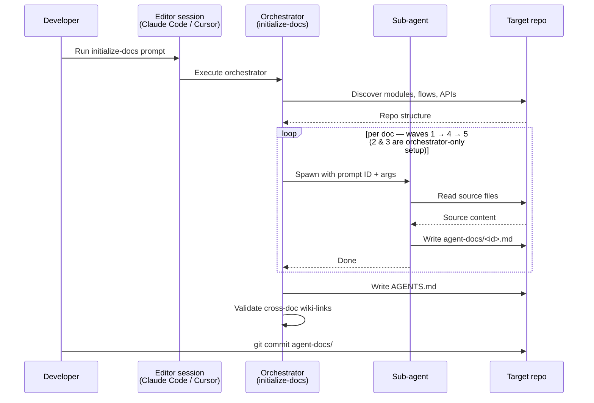
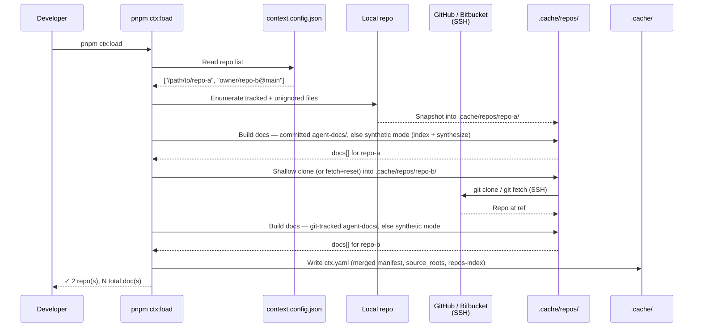
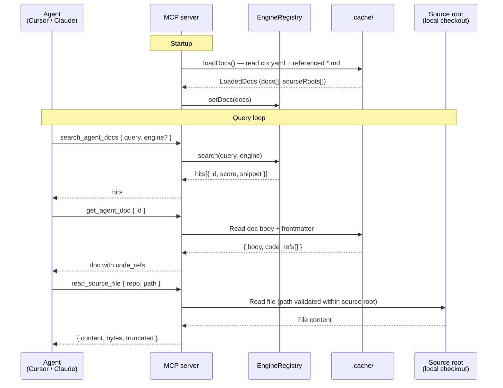

# Direct Context

*An MCP server that turns any repository into searchable agent context.*

Point it at any repo and it works immediately — every repo is snapshotted into a local cache, its source files are indexed, and a compact structured map is synthesized in **synthetic mode** (no AI). Generating richer `agent-docs/` with the prompt toolkit is an optional next step that upgrades a repo to higher-signal context. So `direct-context` is two things in one package:

1. **An MCP server.** Loads one or more repos into a local cache and exposes them to agents via MCP tools (`search_agent_docs`, `get_agent_doc`, `read_source_file`, …) and as MCP prompts. Works out of the box on any repo (synthetic mode); serves committed `agent-docs/` as-is when present.
2. **A doc-generation toolkit.** A library of prompts (under [prompts/](prompts/)) you run against a target repo to produce richer `agent-docs/` — structured markdown describing how the repo works — for sharper retrieval than source alone.

## Features

- **Doc-generation toolkit** — 18 prompts plus a one-shot orchestrator that produce per-repo `agent-docs/`.
- **Synthetic mode** — repos without committed docs are still served: their source files are indexed *and* a compact `agent-docs/` set (`overview`, `architecture`, a consolidated `modules` map, and `project-details`) is synthesized programmatically, so you can point the server at any repo immediately and get a usable map.
- **MCP server** — exposes docs to any MCP client (Cursor, Claude Desktop, etc.) over stdio or HTTP.
- **Multi-repo** — point at any number of local checkouts or GitHub / Bitbucket refs (SSH); a generated `repos-index` doc indexes them all for cross-repo navigation.
- **Four search engines** — `text` (substring), `bm25` (keyword, code-aware), `semantic` (MiniLM, in-process), `hybrid` (RRF fusion of the latter two). Search is chunk-level: hits carry line ranges and line-numbered snippets.
- **Source-file reads** — sandboxed `read_source_file` follows `code_refs` from docs to the actual files.
- **Zero runtime config** — `pnpm ctx:load` writes everything the server needs; the server reads it on startup.

## Quickstart

Steps 1–4 get you a working context server in **synthetic mode** — no doc generation required. Step 5 is the optional optimization pass.

### Step 1 — Install and build

```bash
pnpm install   # requires Node ≥ 20
pnpm build     # produces dist/index.js, the entry point your MCP client will spawn
```

> Remote repos (GitHub / Bitbucket) are cloned over SSH — `ssh-add` your key first if you want to serve any.

### Step 2 — Configure which repos to serve

```bash
cp context.config.example.json context.config.json
```

Edit `context.config.json` and list each repo by absolute path or remote ref:

```json
{
  "repos": [
    "/Users/me/code/my-repo",
    "owner/some-github-repo@main"
  ]
}
```

### Step 3 — Load into the local cache

```bash
pnpm ctx:load   # writes .cache/ctx.yaml
```

Any repo without a committed `agent-docs/` folder is served in **synthetic mode** automatically — it's snapshotted into the cache, its source files are indexed, *and* a compact `agent-docs/` map (`overview` / `architecture` / `modules` / `project-details`) is synthesized programmatically, nothing else required. See [Synthetic mode](#2-load-docs) for what gets generated.

### Step 4 — Wire your MCP client and run

Add the server to your editor's MCP config (Cursor, Claude Desktop, etc.) — see [Client configuration](#client-configuration) below for the exact snippet. For stdio clients (the common case) the editor spawns the server on demand, so there's nothing else to start; restart the editor (or its MCP connection) so direct-context picks up the cache.

**You now have a working context server.** Search, doc fetches, and source reads all work against the synthetic-mode repos (synthesized map + indexed source). The step below is optional and improves retrieval quality.

> Docs and embeddings are loaded once at startup — there is no hot-reload, so every later `pnpm ctx:load` needs a matching reload. Running over HTTP instead of stdio? See [Run the server](#3-run-the-server) for the long-running `pnpm dev:http` / `node dist/index.js --transport http` commands.

### Step 5 — (Optional) Generate docs to optimize a repo's context

Synthetic mode already gives you a compact synthesized map plus indexed source; running the prompt toolkit upgrades a repo to structured, higher-signal context (architecture, modules, flows, APIs, business logic) that retrieves far better and captures what no-AI synthesis can't. With your MCP client wired (Step 4), open the target repo in an agentic editor (Claude Code, Cursor, etc.) and run the one-shot orchestrator prompt:

```
prompts/initialize-docs.md
```

The orchestrator resolves every phase spec through `get_prompt` against the MCP server you wired in Step 4, then fans out sub-agents to produce `agent-docs/*.md` + `AGENTS.md` inside the target repo. Commit the result to that repo's VCS, then re-run `pnpm ctx:load` and reload your client (Steps 3–4) to serve the optimized docs.

> To skip or customize phases, see the [doc-generation section](#1-generate-agent-docs) below.

---

## Usage

### 1. Generate agent docs

This step is **optional** — a repo is already served in synthetic mode (§2 below) without it. Generating an `agent-docs/` folder optimizes a repo's context: markdown files with YAML frontmatter describing the repo's architecture, modules, APIs, data flows, runtime behavior, and conventions — the AI-driven step captures flows, business logic, and design rationale that the programmatic synthetic map can't, and retrieves with far higher signal.

**Recommended: the `initialize-docs` orchestrator.** The fastest path is the one-shot orchestrator at [prompts/initialize-docs.md](prompts/initialize-docs.md). Open the target repo in an agentic editor that can spawn sub-agents, then run the prompt — it discovers the repo's modules/flows/APIs, fans out a sub-agent per doc across five waves (foundations → relevance prune → shared-bundle assembly → fan-out → system-wide; waves 1, 4, 5 produce docs, 2 and 3 are orchestrator-only setup), and finishes by writing an `AGENTS.md` pointer at the repo root and validating cross-doc wiki-links. See [Architecture → Doc generation flow](#doc-generation-flow) for the sequence diagram.

Args you can pass to the orchestrator:

| Arg                  | Meaning                                                                                      |
|----------------------|----------------------------------------------------------------------------------------------|
| `PARALLEL_SUBAGENTS` | Cap on concurrent sub-agents in waves 4 & 5 (default 4).                                     |
| `SUBAGENT_MODEL`     | Model for wave-4 & wave-5 sub-agents (default `claude-sonnet-4-6`). Wave 1 stays on parent.  |
| `SKIP_PHASES`        | Comma-separated prompt IDs to force-skip on top of auto-detected skips (e.g. `10-permissions`). |
| `FORCE_PHASES`       | Comma-separated prompt IDs to force-keep despite auto-detection (e.g. `13-frontend`).        |

**Manual: run individual prompts.** The orchestrator is built on 18 individual prompts under [prompts/](prompts/). Each prompt produces exactly one doc and can be run on its own — useful for partial coverage, re-runs after code changes, or generating a missing doc. They're organized in three tiers:

- **Understand the system (00–06)** — orientation, architecture, per-module deep-dives, data flows, APIs, runtime behavior, glossary.
- **Know the domain (07–12)** — data model, business logic, integrations, permissions, events, errors.
- **Contribute to the system (13–17)** — frontend, deployment, testing, observability, coding patterns.

Each file is self-contained; open it to see its inputs, output path, and the questions it answers. Some take arguments (e.g. `MODULE_NAME`, `FLOW_NAME`) declared in the prompt's frontmatter.

**Output.** The orchestrator writes `agent-docs/` (full file inventory in [Agent-docs format → Folder layout](#folder-layout)) and an `AGENTS.md` pointer at the repo root, alongside the existing source tree. **Commit both to VCS** — that's how they persist and how this server pulls them later.

### 2. Load docs

`pnpm ctx:load` snapshots each configured repo into the cache, builds its docs (committed `agent-docs/` if present, otherwise synthetic mode), and writes a single merged manifest to `.cache/ctx.yaml` — see [Architecture → Loader flow](#loader-flow) for the sequence. Sources come from `context.config.json` next to `package.json`; there is no CLI flag or env-var override. The file is gitignored by default — see [context.config.example.json](context.config.example.json) for a template.

Each `repos` entry supports the following forms:

| Form                                        | Meaning                                                      |
|---------------------------------------------|--------------------------------------------------------------|
| `/abs/path/to/checkout`                     | Local repo — snapshotted into the cache (working tree untouched). |
| `owner/repo` / `owner/repo@ref`             | GitHub via SSH (`git@github.com:owner/repo.git`).            |
| `github:owner/repo@ref`                     | Same as above, explicit prefix.                              |
| `git@github.com:owner/repo.git@ref`         | Full SSH URL, optional `@ref` suffix.                        |
| `bitbucket:owner/repo@ref`                  | Bitbucket via SSH (`git@bitbucket.org:owner/repo.git`).      |
| `git@bitbucket.org:owner/repo.git@ref`      | Full SSH URL, optional `@ref` suffix.                        |

Remote repos are cloned over SSH, so authentication relies on your local SSH agent / keys. There is no token field — make sure your SSH key has read access to any private repo you list.

For each repo, the loader:

- **Local repos**: snapshotted into `.cache/repos/<name>/` (tracked + untracked-but-unignored files, honoring `.gitignore`) — your working tree is never touched. A committed `agent-docs/` is served as-is; otherwise the repo gets synthetic mode (a synthesized map). The cache copy is the source root, so `read_source_file` serves a stable snapshot.
- **Remote repos**: cloned or fetched into `.cache/repos/<name>/`. A git-tracked `agent-docs/` is served as-is; otherwise synthetic mode runs on the clone.
- Writes a single merged `.cache/ctx.yaml` — a manifest listing every doc across all repos with `id`, `kind`, `tags`, `code_refs`, and a `source_roots:` map so the server auto-registers source roots on startup — plus a top-level `repos-index` doc summarizing every loaded repo.

Both kinds live under `.cache/repos/` and are reused across loads: remote clones do a shallow `git fetch` + `reset --hard` rather than re-cloning from scratch, and local snapshots are re-copied each load so they pick up your latest changes.

**Synthetic mode (no committed `agent-docs/`).** Generated docs are recommended, but not required. When a configured repo has no committed `agent-docs/` folder, `ctx:load` falls back to **synthetic mode** instead of erroring. Synthetic mode, without an LLM:

1. **Reads the source files** to drive synthesis — file selection prefers `git ls-files` (tracked files, honoring `.gitignore`) and falls back to a filtered directory walk; binary, oversized (>512 KB), and lockfile entries are skipped. The raw files are **not** added to the search index as `kind: source` docs; agents reach them through `read_source_file`, following the `code_refs` on the synthesized docs below.
2. **Synthesizes a compact map (≤5 files)** programmatically from the repo's own metadata and layout, written into the checkout's `agent-docs/` folder — the same place and layout committed docs use:
   - `overview` — `package.json` summary, README excerpt + heading TOC, language stats, entry points.
   - `architecture` — directory tree + top-level areas + entry/key files.
   - `modules` — one consolidated map: each top-level area with its files and regex-extracted exported symbols (TS/JS, Python, Go, Rust, Java/Kotlin, Ruby, C#, PHP, Swift, C/C++, Scala).
   - `project-details` — build/test/run commands, test setup, config, and CI/deploy signals (emitted only when such signals exist).

   These are tagged `synthetic` and regenerated on every `ctx:load`. They live in the cached checkout (`.cache/repos/<name>/agent-docs/`), so they are never written to your working tree. Synthesized docs are recognized on later loads (untracked in a clone; absent from the freshly re-copied local snapshot), so a committed or AI-authored `agent-docs/` is never clobbered.

Synthetic mode gives an agent a usable map immediately; the AI orchestrator (§1) is the upgrade path when you want flows, business logic, and design rationale. Mix freely — some repos with full `agent-docs/`, some synthetic.

**Repo names must be unique.** Each repo is identified by the basename of its path (local) or the `repo` portion of its ref (remote). If two entries resolve to the same name (e.g. `/work/foo` and `other-owner/foo`), `ctx:load` fails — rename one of the checkouts or drop one entry.

### 3. Run the server

```bash
# Dev — stdio (default; right for IDE clients)
pnpm dev

# Dev — HTTP on :3050
pnpm dev:http

# Production
pnpm build
node dist/index.js                              # stdio
node dist/index.js --transport http --port 3050 # HTTP
```

The server reads from `.cache/` by default. Override with `--docs <path>` or `AGENT_DOCS_DIR=<path>`.

## Client configuration

### stdio (Cursor, Claude Desktop)

```json
{
  "mcpServers": {
    "direct-context": {
      "command": "node",
      "args": [
        "/abs/path/to/direct-context/dist/index.js"
      ]
    }
  }
}
```

`.cache/` is resolved relative to the package itself (not the client's working directory), so the client doesn't need a `cwd`. If you want to keep the cache elsewhere, pass `--docs /abs/path` or set `AGENT_DOCS_DIR`.

### HTTP

Start the server (see [§3 Run the server](#3-run-the-server) for the full command list), then point your client at it:

```json
{
  "mcpServers": {
    "direct-context": {
      "url": "http://localhost:3050/"
    }
  }
}
```

## Configuration reference

| Flag             | Env var               | Default       | Notes                                                                                                  |
|------------------|-----------------------|---------------|--------------------------------------------------------------------------------------------------------|
| `--docs`         | `AGENT_DOCS_DIR`      | `.cache`      | Explicit agent-docs directory override.                                                                |
| `--engine`       | `CONTEXT_ENGINE`      | `hybrid`      | Default search engine. One of `text`, `bm25`, `semantic`, `hybrid`. `hybrid`/`semantic` download a model on first query. |
| `--transport`    | `CONTEXT_TRANSPORT`   | `stdio`       | Transport. One of `stdio`, `http`.                                                                     |
| `--port`         | `CONTEXT_PORT`        | `3050`        | Port for HTTP transport. Ignored when transport is `stdio`.                                            |
| `--source-root`  | `AGENT_SOURCE_ROOTS`  | (none)        | Source-code root the `read_source_file` tool may read from. Repeatable flag; env var is comma-separated. |

## MCP tools

| Tool                  | Input                          | Output                                                               |
|-----------------------|--------------------------------|----------------------------------------------------------------------|
| `list_agent_docs`     | (none)                         | `{ count, docs: [{ id, title, kind, tags, path }] }`                 |
| `get_agent_doc`       | `{ id }`                       | `{ id, title, kind, tags, path, code_refs, frontmatter, body }`      |
| `search_agent_docs`   | `{ query, k?, engine? }`       | `{ engine, query, hits: [{ id, title, score, snippet }] }`           |
| `get_prompt`          | `{ id }`                       | `{ id, description, body, args, sources }`                           |
| `list_source_roots`*  | (none)                         | `{ count, roots: [{ name }] }`                                       |
| `read_source_file`*   | `{ repo, path, max_bytes? }`   | `{ repo, path, bytes, truncated, content }`                          |
| `list_source_dir`*    | `{ repo, path }`               | `{ repo, path, entries: [{ name, path, type }] }`                    |
| `search_source_files`*| `{ query, repo?, glob?, case_sensitive?, max_results?, max_file_bytes? }` | `{ query, repo, count, truncated, matches: [{ repo, path, line, text }] }` |

\* Registered only when at least one source root is configured.

The `engine` argument on `search_agent_docs` lets a single running server compare engines live — useful for picking the right default.

### `code_refs` — pointers from docs to source files

Every agent doc carries a `code_refs:` block in its frontmatter listing the source files it cites. Bare paths and full objects are both accepted:

```yaml
code_refs:
  - services/user-api/src/schemas/user.ts          # bare path
  - repo: platform                                  # full object
    path: services/user-api/src/routes/users.ts
    ref: createUser
    description: "POST /users handler"
```

`get_agent_doc` returns `code_refs` as a typed array. When a doc was loaded multi-repo, any entry missing `repo` is defaulted to the cache directory name — so an agent can pass any entry straight to `read_source_file({ repo, path })` without stitching anything together.

The intended agent loop is: `search_agent_docs` → `get_agent_doc` (returns `code_refs`) → `read_source_file({ repo, path })` for the files it actually needs.

## MCP prompts

Every `*.md` file under `prompts/` (except `README.md` and `_*`-prefixed files) is registered as an MCP prompt. The MCP-protocol prompt name uses the file basename (without `.md`) with non-alphanumeric characters replaced by `_` (e.g. `00-orientation.md` → `00_orientation`). The `get_prompt` tool uses the raw basename without that substitution (e.g. `00-orientation`).

Each prompt's frontmatter declares `args` for any `$VAR` / `${VAR}` tokens it references. These are passed through as documentation for the agent — the server does **not** perform variable substitution at the MCP protocol level. The agent interprets the tokens from the prompt text itself.

## Search engines

All engines search **chunks**, not whole files: each doc is split into structure-aware slices (code on function/class boundaries, markdown on headings; long sections windowed with overlap). Hits therefore carry the parent doc `id` plus the matched `startLine`/`endLine` and a line-numbered snippet — so an agent can jump straight to the region with `read_source_file`. Chunking also keeps each unit near the embedding model's token window, so content deep in a large file stays retrievable.

| Engine     | Tech                                                                                           | Pros                                               | Cons                                                       |
|------------|------------------------------------------------------------------------------------------------|----------------------------------------------------|------------------------------------------------------------|
| `text`     | substring + tag/title boost                                                                    | zero deps, instant startup, predictable            | exact-match only, no stemming, no semantic recall          |
| `bm25`     | [minisearch](https://lucaong.github.io/minisearch/) (BM25, fuzzy, prefix) with a code-aware tokenizer that splits camelCase/snake_case identifiers | strong default for keyword-style queries; `get user` finds `getUserById`; no model | still keyword-based                                        |
| `semantic` | [@huggingface/transformers](https://huggingface.co/docs/transformers.js) MiniLM-L6, in-process | conceptual recall ("how do tokens get validated")  | first run downloads the model (cached under `.transformers-cache`); embeds all chunks at start |
| `hybrid`   | Reciprocal Rank Fusion of `bm25` + `semantic`                                                  | best overall recall — combines exact-keyword and conceptual matches | pulls in the semantic engine, so it carries the same model-download cost |

The semantic and hybrid engines are initialized lazily on first query, so startup stays snappy if you never use them.

## Architecture

### Doc generation flow

The `initialize-docs` orchestrator runs inside an agentic editor opened on the target repo. It fans out to sub-agents (one per doc), each of which reads its prompt spec, writes one markdown file, and reports back.



### Loader flow

`pnpm ctx:load` reads the repo list from `context.config.json`, snapshots each repo into `.cache/repos/` (a copy for local repos; a clone for remote ones), builds its docs (committed `agent-docs/` or synthetic mode), and writes a single merged `.cache/ctx.yaml` that the server reads at runtime.



### Query loop

At runtime, an agent typically searches docs, fetches a doc's body + `code_refs`, then reads the cited source files directly. The server resolves source paths against registered roots and rejects anything that escapes them.



### Agent-docs format

The on-disk format every `agent-docs/` folder must follow. Step 1 of [Usage](#usage) produces it; step 2's loader consumes it.

#### Folder layout

```
agent-docs/
├── index.yaml          # optional hand-maintained manifest; if absent, loader walks *.md
├── overview.md         # required: top-level overview of the repo
├── architecture.md     # optional: components, boundaries, deployment
├── glossary.md         # optional: domain glossary
├── business-logic.md   # optional: domain rules, invariants, state machines
├── data-model.md       # optional: entities, schemas, migrations
├── permissions.md      # optional: authn/authz, roles, scopes
├── integrations.md     # optional: external service contracts
├── runtime-behavior.md # optional: env vars, config files, feature flags (kind: configuration)
├── jobs.md             # optional: async work, cron, queues
├── events.md           # optional: message contracts, topics
├── errors.md           # optional: error taxonomy, resilience
├── observability.md    # optional: logging, metrics, traces, SLOs
├── deployment.md       # optional: CI/CD, infra, rollout
├── ownership.md        # optional: teams, CODEOWNERS, on-call
├── frontend.md         # optional: UI framework, routing, state, design system
├── compliance.md       # optional: privacy, GDPR, audit, retention
├── testing.md          # optional: test strategy, coverage, fixtures
├── patterns.md         # optional: coding conventions and patterns
├── project-details.md  # optional: compact single-file snapshot
├── modules/            # optional: one file per module
│   └── <name>.md
├── flows/              # optional: one file per data or user flow
│   └── <name>.md
└── apis/               # optional: one file per public API surface
    └── <name>.md
```

If `index.yaml` is absent the loader walks `*.md` recursively under the docs root.

#### File format

Each `.md` file is a plain Markdown document with a top-level heading:

```markdown
# Authentication

…
```

`id`, `title`, and `kind` are inferred from the file's path and first `# ` heading:

| Field   | Inferred from                                                                 |
|---------|-------------------------------------------------------------------------------|
| `id`    | Path relative to the docs root, with the `.md` extension stripped.            |
| `title` | First `# ` heading in the body. Falls back to `id`.                           |
| `kind`  | Path: `modules/` → `module`, `flows/` → `flow`, `apis/` → `api`. Otherwise the basename is matched to a `DocKind` from the table below — `overview`, `architecture`, `glossary`, etc. The filename `runtime-behavior.md` is aliased to `kind: configuration`. Unrecognized basenames fall back to `note`. |
| `tags`  | Empty unless overridden by frontmatter.                                       |

YAML frontmatter is optional. When present, its `id`, `title`, `kind`, and `tags` override the inferred values; any other keys are preserved on the loaded doc:

```markdown
---
id: modules/auth
title: Authentication
kind: module
tags: [auth, security]
source: src/auth          # arbitrary extras are preserved
---

# Authentication
…
```

#### `kind` values

| Kind              | Used for                                          |
|-------------------|---------------------------------------------------|
| `overview`        | Top-level repository overview                     |
| `architecture`    | Components, boundaries, deployment topology       |
| `module`          | One coherent subsystem or package                 |
| `flow`            | Data or user flow through the system              |
| `api`             | Public API surface (HTTP, gRPC, CLI, SDK, events) |
| `glossary`        | Domain glossary                                   |
| `note`            | Free-form note                                    |
| `project-details` | Compact single-file project snapshot              |
| `business-logic`  | Domain rules, invariants, state machines          |
| `data-model`      | Entities, schemas, storage, migrations            |
| `permissions`     | Authentication and authorization                  |
| `integrations`    | External service contracts and topology           |
| `configuration`   | Env vars, config files, feature flags, secrets    |
| `jobs`            | Async work, cron, queues, workers                 |
| `events`          | Message contracts, topics, event bus              |
| `errors`          | Error taxonomy, resilience, retries               |
| `observability`   | Logging, metrics, traces, SLOs, alerts            |
| `deployment`      | CI/CD, infrastructure, rollout strategy           |
| `ownership`       | Teams, CODEOWNERS, on-call rotations              |
| `frontend`        | UI framework, routing, state, design system       |
| `compliance`      | Privacy, GDPR, audit trails, data retention       |
| `testing`         | Test strategy, coverage, fixtures, tooling        |
| `patterns`        | Coding conventions and patterns                   |

Optional frontmatter fields are allowed and preserved by the loader (e.g. `source`, `entrypoint`, `api_kind`, `code_refs`).

#### `index.yaml` manifest

`index.yaml` is the canonical entry point. It is **generated automatically** by `pnpm ctx:load` from the frontmatter of every `*.md` file under the docs root. Authors don't write or maintain it by hand — they only need correct frontmatter (`id`, `title`, `kind`, `tags`) on each markdown file. Any pre-existing `index.yaml` shipped with a source repo is replaced when the docs are loaded into the cache.

Minimum example:

```yaml
title: my-repo
generated_at: 2026-05-01T18:00:00Z
files:
  - id: overview
    path: overview.md
    kind: overview
  - id: modules/auth
    path: modules/auth.md
    kind: module
    tags: [auth]
```

If a file is listed in the manifest, the manifest entry wins (its `id`, `kind`, `tags` are used). If a file exists on disk but isn't in the manifest, it's still loaded (with frontmatter as the source of truth).

## License

MIT — see [LICENSE](LICENSE).
