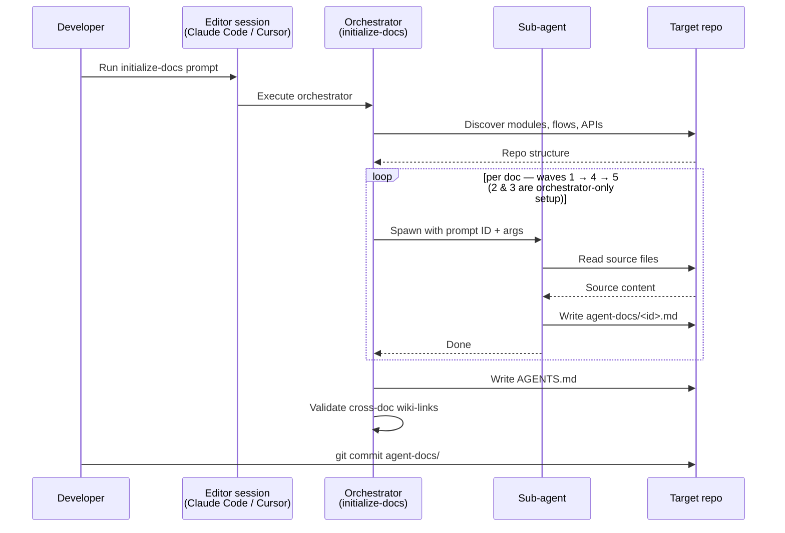
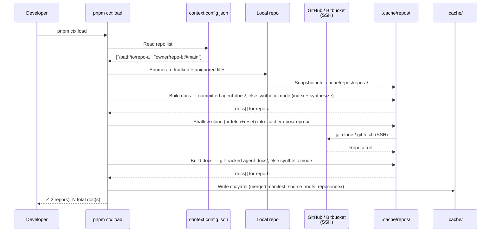
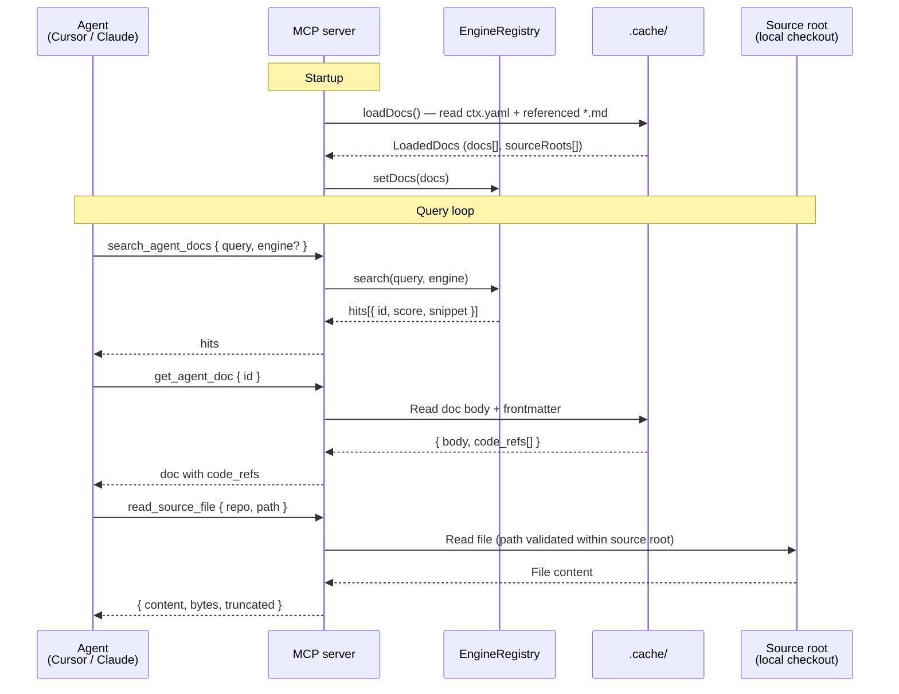

# Direct Context

*An MCP server that turns any repository into searchable agent context.*

Point it at any repo and it works immediately — `direct-context` snapshots each repo into a local cache and serves it to agents over MCP. It's two things in one package:

1. **An MCP server.** Exposes one or more repos to agents via MCP tools (`search_agent_docs`, `get_agent_doc`, `read_source_file`, …) and prompts. Serves committed `agent-docs/` as-is, or falls back to a programmatically synthesized map in **synthetic mode** — so any repo works out of the box.
2. **A doc-generation toolkit.** A library of prompts (under [prompts/](prompts/)) you run against a target repo to produce richer `agent-docs/` for sharper retrieval than source alone.

## Features

- **Synthetic mode** — repos without committed docs still work: a compact `agent-docs/` map is synthesized programmatically (no AI). See [Load docs](#2-load-docs).
- **Doc-generation toolkit** — 18 prompts plus a one-shot orchestrator that produce richer per-repo `agent-docs/`.
- **MCP server** — stdio or HTTP, for any MCP client (Cursor, Claude Desktop, etc.).
- **Multi-repo** — any number of local checkouts or GitHub / Bitbucket refs (SSH), indexed together for cross-repo navigation.
- **Four search engines** — `text`, `bm25`, `semantic`, `hybrid`; chunk-level hits with line ranges and snippets. See [Search engines](#search-engines).
- **Source-file reads** — sandboxed `read_source_file` follows `code_refs` from docs to the actual files.

## Quickstart

### Step 1 — Install and build

```bash
pnpm install   # requires Node ≥ 20
pnpm build     # produces dist/index.js, the entry point your MCP client will spawn
```

> Remote repos (GitHub / Bitbucket) are cloned over SSH — `ssh-add` your key first if you want to serve any.

### Step 2 — Configure which repos to serve

```bash
cp context.config.example.json context.config.json
```

Edit `context.config.json` and list each repo by absolute path or remote ref:

```json
{
  "repos": [
    "/Users/me/code/my-repo",
    "owner/some-github-repo@main"
  ]
}
```

### Step 3 — Load into the local cache

```bash
pnpm ctx:load   # writes .cache/ctx.yaml
```

Repos without a committed `agent-docs/` folder are served in **synthetic mode** automatically — see [Load docs](#2-load-docs).

### Step 4 — Wire your MCP client and run

Add the server to your editor's MCP config (Cursor, Claude Desktop, etc.) — see [Client configuration](#client-configuration) below for the exact snippet. For stdio clients (the common case) the editor spawns the server on demand, so there's nothing else to start; restart the editor (or its MCP connection) so direct-context picks up the cache.

**You now have a working context server.** Search, doc fetches, and source reads all work.

> Docs are loaded once at startup — there is no hot-reload, so every later `pnpm ctx:load` needs a matching reload. For HTTP instead of stdio, see [Run the server](#3-run-the-server).

## Usage

### 1. Generate agent docs

**Optional** — synthetic mode (§2) already serves a usable map. Generating an `agent-docs/` folder upgrades a repo to structured, higher-signal context (architecture, modules, flows, APIs, business logic): AI-authored markdown capturing the flows, business logic, and design rationale the programmatic synthetic map can't, and that retrieves far better.

**Recommended — the orchestrator.** Open the target repo in an agentic editor that can spawn sub-agents and run [prompts/initialize-docs.md](prompts/initialize-docs.md). It discovers the repo's modules/flows/APIs, fans out one sub-agent per doc, then writes an `AGENTS.md` pointer and validates cross-doc links. See [Architecture → Doc generation flow](#doc-generation-flow). Args:

| Arg                  | Meaning                                                                                      |
|----------------------|----------------------------------------------------------------------------------------------|
| `PARALLEL_SUBAGENTS` | Cap on concurrent sub-agents in waves 4 & 5 (default 4).                                     |
| `SUBAGENT_MODEL`     | Model for wave-4 & wave-5 sub-agents (default `claude-sonnet-4-6`). Wave 1 stays on parent.  |
| `SKIP_PHASES`        | Comma-separated prompt IDs to force-skip on top of auto-detected skips (e.g. `10-permissions`). |
| `FORCE_PHASES`       | Comma-separated prompt IDs to force-keep despite auto-detection (e.g. `13-frontend`).        |

**Manual — individual prompts.** The orchestrator is built on 18 prompts under [prompts/](prompts/), each producing one doc and runnable on its own (partial coverage, re-runs, a missing doc). They cover understanding the system (`00–06`), the domain (`07–12`), and contributing (`13–17`). Each file declares its own inputs, output path, and any args (e.g. `MODULE_NAME`).

**Commit** the resulting `agent-docs/` and `AGENTS.md` to the target repo's VCS, then re-run `pnpm ctx:load` and reload your client (§2) to serve them — committing is how the docs persist and how the server picks them up on later loads.

### 2. Load docs

`pnpm ctx:load` snapshots each configured repo into `.cache/repos/`, builds its docs (committed `agent-docs/` if present, otherwise synthetic mode), and writes a single merged manifest to `.cache/ctx.yaml` that the server reads at runtime — see [Architecture → Loader flow](#loader-flow). Local repos are re-copied each load (working tree untouched); remote repos are shallow-cloned or fetched over SSH, so auth relies on your local SSH agent. Sources come from `context.config.json` (gitignored; see [context.config.example.json](context.config.example.json)) — no CLI or env override. Repo names must be unique (the path/ref basename); collisions fail the load.

Each `repos` entry supports the following forms:

| Form                                        | Meaning                                                      |
|---------------------------------------------|--------------------------------------------------------------|
| `/abs/path/to/checkout`                     | Local repo — snapshotted into the cache (working tree untouched). |
| `owner/repo` / `owner/repo@ref`             | GitHub via SSH (`git@github.com:owner/repo.git`).            |
| `github:owner/repo@ref`                     | Same as above, explicit prefix.                              |
| `git@github.com:owner/repo.git@ref`         | Full SSH URL, optional `@ref` suffix.                        |
| `bitbucket:owner/repo@ref`                  | Bitbucket via SSH (`git@bitbucket.org:owner/repo.git`).      |
| `git@bitbucket.org:owner/repo.git@ref`      | Full SSH URL, optional `@ref` suffix.                        |

The merged `.cache/ctx.yaml` lists every doc across all repos (`id`, `kind`, `tags`, `code_refs`) plus a `source_roots:` map the server auto-registers on startup, and a top-level `repos-index` doc summarizing every loaded repo.

**Synthetic mode (no committed `agent-docs/`).** When a repo has no committed `agent-docs/`, `ctx:load` falls back to synthetic mode instead of erroring — no LLM required. From the repo's own metadata and layout (file selection via `git ls-files`, skipping binary/oversized/lockfile entries), it synthesizes a compact map (≤5 files) into the cached checkout's `agent-docs/`:

- `overview` — `package.json` summary, README excerpt + TOC, language stats, entry points.
- `architecture` — directory tree, top-level areas, entry/key files.
- `modules` — one consolidated map of each area's files and regex-extracted exported symbols (TS/JS, Python, Go, Rust, Java/Kotlin, Ruby, C#, PHP, Swift, C/C++, Scala).
- `project-details` — build/test/run commands, config, CI/deploy signals (when present).

These are tagged `synthetic` and regenerated every load, and live only in the cache — a committed or AI-authored `agent-docs/` is never clobbered. Source files aren't indexed directly; agents reach them via `read_source_file` following each doc's `code_refs`. Mix freely — some repos with full `agent-docs/`, some synthetic; the orchestrator (§1) is the upgrade path.

### 3. Run the server

```bash
# Dev — stdio (default; right for IDE clients)
pnpm dev

# Dev — HTTP on :3050
pnpm dev:http

# Production
pnpm build
node dist/index.js                              # stdio
node dist/index.js --transport http --port 3050 # HTTP
```

The server reads from `.cache/` by default. Override with `--docs <path>` or `AGENT_DOCS_DIR=<path>`.

## Client configuration

### stdio (Cursor, Claude Desktop)

```json
{
  "mcpServers": {
    "direct-context": {
      "command": "node",
      "args": [
        "/abs/path/to/direct-context/dist/index.js"
      ]
    }
  }
}
```

`.cache/` is resolved relative to the package itself (not the client's working directory), so the client doesn't need a `cwd`. If you want to keep the cache elsewhere, pass `--docs /abs/path` or set `AGENT_DOCS_DIR`.

### HTTP

Start the server (see [§3 Run the server](#3-run-the-server) for the full command list), then point your client at it:

```json
{
  "mcpServers": {
    "direct-context": {
      "url": "http://localhost:3050/"
    }
  }
}
```

## Configuration reference

| Flag             | Env var               | Default       | Notes                                                                                                  |
|------------------|-----------------------|---------------|--------------------------------------------------------------------------------------------------------|
| `--docs`         | `AGENT_DOCS_DIR`      | `.cache`      | Explicit agent-docs directory override.                                                                |
| `--engine`       | `CONTEXT_ENGINE`      | `hybrid`      | Default search engine. One of `text`, `bm25`, `semantic`, `hybrid`. `hybrid`/`semantic` download a model on first query. |
| `--transport`    | `CONTEXT_TRANSPORT`   | `stdio`       | Transport. One of `stdio`, `http`.                                                                     |
| `--port`         | `CONTEXT_PORT`        | `3050`        | Port for HTTP transport. Ignored when transport is `stdio`.                                            |
| `--source-root`  | `AGENT_SOURCE_ROOTS`  | (none)        | Source-code root the `read_source_file` tool may read from. Repeatable flag; env var is comma-separated. |

## MCP tools

| Tool                  | Input                          | Output                                                               |
|-----------------------|--------------------------------|----------------------------------------------------------------------|
| `list_agent_docs`     | (none)                         | `{ count, docs: [{ id, title, kind, tags, path }] }`                 |
| `get_agent_doc`       | `{ id }`                       | `{ id, title, kind, tags, path, code_refs, frontmatter, body }`      |
| `search_agent_docs`   | `{ query, k?, engine? }`       | `{ engine, query, hits: [{ id, title, score, snippet }] }`           |
| `get_prompt`          | `{ id }`                       | `{ id, description, body, args, sources }`                           |
| `list_source_roots`*  | (none)                         | `{ count, roots: [{ name }] }`                                       |
| `read_source_file`*   | `{ repo, path, max_bytes? }`   | `{ repo, path, bytes, truncated, content }`                          |
| `list_source_dir`*    | `{ repo, path }`               | `{ repo, path, entries: [{ name, path, type }] }`                    |
| `search_source_files`*| `{ query, repo?, glob?, case_sensitive?, max_results?, max_file_bytes? }` | `{ query, repo, count, truncated, matches: [{ repo, path, line, text }] }` |

\* Registered only when at least one source root is configured.

The `engine` argument on `search_agent_docs` lets a single running server compare engines live — useful for picking the right default.

### `code_refs` — pointers from docs to source files

Every agent doc carries a `code_refs:` block in its frontmatter listing the source files it cites. Bare paths and full objects are both accepted:

```yaml
code_refs:
  - services/user-api/src/schemas/user.ts          # bare path
  - repo: platform                                  # full object
    path: services/user-api/src/routes/users.ts
    ref: createUser
    description: "POST /users handler"
```

`get_agent_doc` returns `code_refs` as a typed array. When a doc was loaded multi-repo, any entry missing `repo` is defaulted to the cache directory name — so an agent can pass any entry straight to `read_source_file({ repo, path })` without stitching anything together.

The intended agent loop is: `search_agent_docs` → `get_agent_doc` (returns `code_refs`) → `read_source_file({ repo, path })` for the files it actually needs.

## MCP prompts

Every `*.md` file under `prompts/` (except `README.md` and `_*`-prefixed files) is registered as an MCP prompt. The MCP-protocol prompt name uses the file basename (without `.md`) with non-alphanumeric characters replaced by `_` (e.g. `00-orientation.md` → `00_orientation`). The `get_prompt` tool uses the raw basename without that substitution (e.g. `00-orientation`).

Each prompt's frontmatter declares `args` for any `$VAR` / `${VAR}` tokens it references. These are passed through as documentation for the agent — the server does **not** perform variable substitution at the MCP protocol level. The agent interprets the tokens from the prompt text itself.

## Search engines

All engines search **chunks**, not whole files: each doc is split into structure-aware slices (code on function/class boundaries, markdown on headings; long sections windowed with overlap). Hits therefore carry the parent doc `id` plus the matched `startLine`/`endLine` and a line-numbered snippet — so an agent can jump straight to the region with `read_source_file`. Chunking also keeps each unit near the embedding model's token window, so content deep in a large file stays retrievable.

| Engine     | Tech                                                                                           | Pros                                               | Cons                                                       |
|------------|------------------------------------------------------------------------------------------------|----------------------------------------------------|------------------------------------------------------------|
| `text`     | substring + tag/title boost                                                                    | zero deps, instant startup, predictable            | exact-match only, no stemming, no semantic recall          |
| `bm25`     | [minisearch](https://lucaong.github.io/minisearch/) (BM25, fuzzy, prefix) with a code-aware tokenizer that splits camelCase/snake_case identifiers | strong default for keyword-style queries; `get user` finds `getUserById`; no model | still keyword-based                                        |
| `semantic` | [@huggingface/transformers](https://huggingface.co/docs/transformers.js) MiniLM-L6, in-process | conceptual recall ("how do tokens get validated")  | first run downloads the model (cached under `.transformers-cache`); embeds all chunks at start |
| `hybrid`   | Reciprocal Rank Fusion of `bm25` + `semantic`                                                  | best overall recall — combines exact-keyword and conceptual matches | pulls in the semantic engine, so it carries the same model-download cost |

The semantic and hybrid engines are initialized lazily on first query, so startup stays snappy if you never use them.

## Architecture

### Doc generation flow

The `initialize-docs` orchestrator runs inside an agentic editor opened on the target repo. It fans out to sub-agents (one per doc), each of which reads its prompt spec, writes one markdown file, and reports back.



### Loader flow

`pnpm ctx:load` reads the repo list from `context.config.json`, snapshots each repo into `.cache/repos/` (a copy for local repos; a clone for remote ones), builds its docs (committed `agent-docs/` or synthetic mode), and writes a single merged `.cache/ctx.yaml` that the server reads at runtime.



### Query loop

At runtime, an agent typically searches docs, fetches a doc's body + `code_refs`, then reads the cited source files directly. The server resolves source paths against registered roots and rejects anything that escapes them.



### Agent-docs format

The on-disk format every `agent-docs/` folder follows — Step 1 produces it, Step 2's loader consumes it. Only `overview.md` is required; everything else is optional.

```
agent-docs/
├── overview.md         # required: top-level overview
├── architecture.md     # components, boundaries, deployment
├── <topic>.md          # data-model, permissions, integrations, runtime-behavior,
│                       #   events, errors, deployment, testing, patterns, …
├── project-details.md  # compact single-file snapshot
├── modules/<name>.md   # one file per module
├── flows/<name>.md     # one file per data or user flow
└── apis/<name>.md      # one file per public API surface
```

Each file is plain Markdown with a top-level `# ` heading. `id`, `title`, and `kind` are inferred from the path and heading:

| Field   | Inferred from                                                                 |
|---------|-------------------------------------------------------------------------------|
| `id`    | Path relative to the docs root, `.md` stripped.                               |
| `title` | First `# ` heading in the body. Falls back to `id`.                           |
| `kind`  | Path: `modules/` → `module`, `flows/` → `flow`, `apis/` → `api`. Otherwise the basename — `overview`, `architecture`, `data-model`, etc. (`runtime-behavior` → `configuration`); unrecognized → `note`. |
| `tags`  | Empty unless set in frontmatter.                                              |

Optional YAML frontmatter overrides the inferred `id`/`title`/`kind`/`tags`; any other keys (`source`, `code_refs`, …) are preserved:

```markdown
---
id: modules/auth
title: Authentication
kind: module
tags: [auth, security]
---

# Authentication
…
```

`pnpm ctx:load` auto-generates `index.yaml` from this frontmatter, so authors never write it by hand — any pre-existing `index.yaml` is replaced on load. If absent at author time, the loader simply walks `*.md` recursively.

## License

MIT — see [LICENSE](LICENSE).
