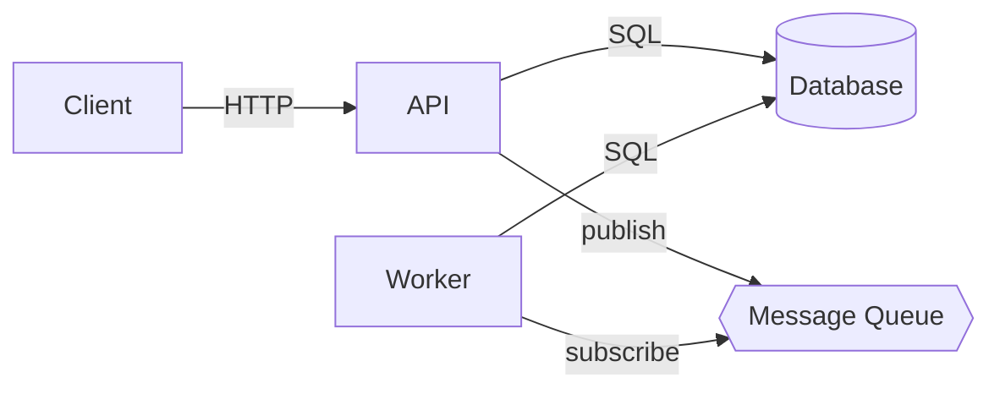

# Architecture

You are documenting the high-level architecture of the currently open project
so that a future LLM coding agent can reason about component boundaries,
data flow, and deployment topology.

## Goal

Produce an architecture document that captures every major component, how they
connect, and where they run.

## Steps

1. **Enumerate components**
   - Services, apps, workers, CLI tools, shared libraries — anything that is
     independently deployable or importable.
   - For each: name, responsibility (1 sentence), primary language.
   - **Source location**: GitHub repo (`owner/repo`) and path within the repo
     if monorepo. This is critical — an AI agent needs to know *where to look*
     to read or change a component's code.

2. **Map connections**
   - How do the components talk to each other? (HTTP, gRPC, message queue,
     shared DB, in-process import, etc.)
   - Which connections are synchronous vs. asynchronous?

3. **Describe the data stores**
   - Databases, caches, object stores, search indices.
   - Which component owns each store? Are there shared stores?

4. **Draw a component diagram**
   - Use Mermaid syntax so the diagram renders in Markdown viewers.

5. **Note cross-cutting concerns**
   - Auth/authz, observability, feature flags, rate limiting — where are they
     enforced?

6. **Identify deployment boundaries**
   - Is this a monolith, modular monolith, or microservices?
   - Where does each component run? (Kubernetes, Lambda, Vercel, local CLI…)

7. **Component-to-repository map**
   - Build a table mapping every component to its source location. This is the
     single most important reference for an AI agent using GitHub MCP:

   | Component      | GitHub repo        | Path within repo    | Language   |
   |----------------|--------------------|---------------------|------------|
   | user-api       | acme/platform      | services/user-api/  | TypeScript |
   | billing-worker | acme/platform      | services/billing/   | TypeScript |
   | mobile-app     | acme/mobile        | /                   | Kotlin     |
   | shared-types   | acme/platform      | packages/types/     | TypeScript |

## Source-file references

While documenting, note the repo-relative path of every source file you
cite (entry points, framework wiring, infra-as-code, etc.). Emit them in
the `code_refs:` block of the output frontmatter so an agent reading this
doc can fetch them via `read_source_file({ repo, path })`.

## Output

Write the result as a Markdown file to `agent-docs/architecture.md` using this
frontmatter (fill in `title` and `tags` from what you find):

---
id: architecture
title: "Architecture"
kind: architecture
tags: []
code_refs:
  # List every source file this doc cites, so an agent can fetch them via
  # read_source_file({ repo, path }). `repo` is the source-root name from
  # list_source_roots. `ref` and `description` are optional.
  - repo: <source-root name>
    path: <relative/path/to/file.ext>
    ref: <optional symbol or line anchor>
    description: <what this file contributes>
sources:
  - id: integrations
    relation: drilldown
    path: integrations.md
    description: "understand external dependencies in the topology"
  - id: deployment
    relation: companion
    path: deployment.md
    description: "how components are packaged and run"
---

Include a Mermaid component diagram using this scaffold (adjust nodes and
edges to match the actual system):

Keep the document under 400 lines.
