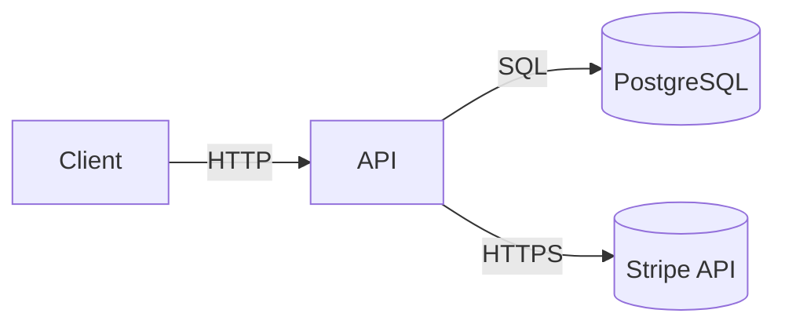

# System Architecture

shopcart is a single Node.js service that exposes a REST API, persists to
PostgreSQL, and talks to Stripe for payments.

The auth module guards every REST endpoint; the billing module owns the
Stripe integration and the checkout flow ties them together.
