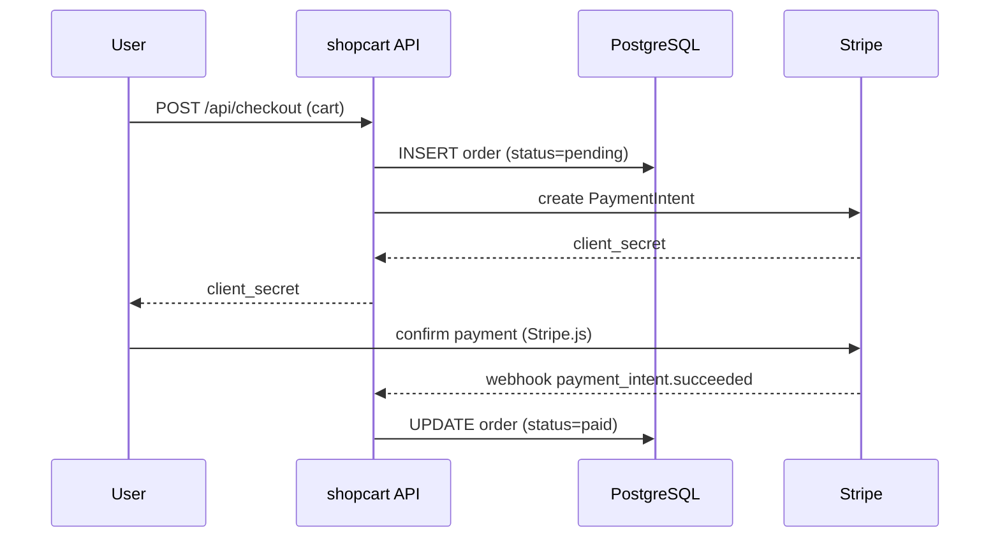

# Checkout flow

End-to-end trace of a user completing a checkout in shopcart, from the
cart submission through the Stripe payment intent confirmation.

## Steps

1. Client posts the cart to `POST /api/checkout`.
2. API writes a `pending` order row.
3. API asks the billing module to create a Stripe payment intent.
4. Client confirms the payment intent via Stripe.js.
5. Stripe sends a webhook; the billing module marks the order paid.
